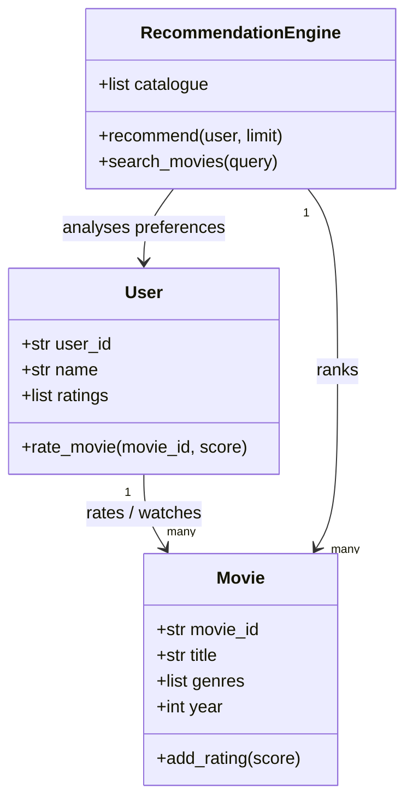

# AI Movie Recommendation System — Assessment 3 Starter

This starter project is organised around the assessment rubric. It contains a small Streamlit prototype that can be extended with persistent storage, authentication, screenshots, and deployment.

## Run locally

```text
python -m pip install -r requirements.txt
streamlit run app.py
```

The demo admin key is `MRS-ADMIN-2026`. Change it before submission.

## Suggested completion checklist

- [ ] Replace the demo in-memory data with a CSV, SQLite database, or another persistent data store.
- [ ] Add registered-user login and keep each user's history and ratings separate.
- [ ] Improve the recommendation algorithm and explain the scoring logic in the report.
- [ ] Add screenshots for search, rating, dashboard, and admin workflows.
- [ ] Draw/export the UML diagram and include it in the documentation.
- [ ] Deploy the app publicly and record the URL and deployment steps.

## UML starting point



## Report structure

1. System overview and assumptions.
2. UML class diagram.
3. Attribute and method descriptions.
4. Recommendation logic, data updates, and machine learning discussion.
5. Interface design and user journeys.
6. Dashboard and visualisation evidence.
7. Administrator console and access key.
8. Deployment summary and public URL.
9. Appendix: source code and screenshots.
