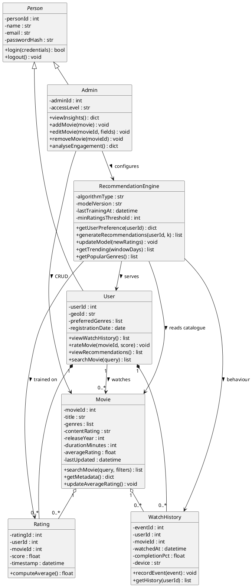

# Part A — Question 1: Movie Recommendation System Design

**Scenario recap.** You are building an AI-powered Movie Recommendation System (MRS) for a major streaming platform. The MRS consumes *user viewing history, ratings, and preferences* to deliver personalised movie suggestions, and surfaces operational insights about trending genres, popular titles, and engagement patterns for administrators.

This document covers **Task 1.1 (UML class diagram)**, **Task 1.2 (method / attribute descriptions with rationale)**, and **Task 1.3 (user-behaviour analysis + recommendation logic)**.

---

## Task 1.1 — UML Class Diagram (5 marks)

### Class inventory — 7 classes

The assignment requires "at least three classes". I expanded to seven so the model honestly reflects the scenario — the brief explicitly mentions *viewing history, ratings, and preferences*, so `Rating` and `WatchHistory` are first-class entities rather than hidden inside other classes. Modelling them explicitly also makes the relationships in Task 1.3 far easier to explain.

| Class | Role |
|---|---|
| `Person` | Abstract parent capturing shared identity + authentication |
| `User` | Registered, non-administrative viewer (inherits `Person`) |
| `Admin` | Privileged operator with catalogue + analytics access (inherits `Person`) |
| `Movie` | Catalogue entity describing a film |
| `Rating` | Join entity — a `User`'s score for a `Movie` |
| `WatchHistory` | Join entity — a `User`'s viewing events on a `Movie` |
| `RecommendationEngine` | Core service that produces recommendations + insights |

### Diagram (PlantUML source)

### Relationships explained

| Relationship | Notation | Meaning |
|---|---|---|
| `Person <|-- User` and `Person <|-- Admin` | Open-triangle (generalisation) | Inheritance. `User` and `Admin` *are* `Person`s; they share identity attributes (`name`, `email`) and authentication behaviour (`login()`). Differ only in role-specific permissions. |
| `User *-- WatchHistory` and `User *-- Rating` | Filled diamond (composition) | A `User` *owns* their history and ratings. These rows are meaningless without their owning `User`. |
| `Movie o-- Rating` and `Movie o-- WatchHistory` | Open diamond (aggregation) | `Movie` *refers to* many `Rating` and `WatchHistory` rows. Multiple `User`s rate / watch the same movie. |
| `RecommendationEngine --> User/Movie/Rating/WatchHistory` | Open arrow (dependency) | The engine reads these classes to compute recommendations. Its own state lives in a model file, not in those classes. |
| `Admin --> RecommendationEngine` and `Admin --> Movie` | Open arrow (association) | The admin authenticates against `RecommendationEngine` for analytics and performs CRUD against `Movie`. |

### Improvements over the original 5-class draft

| Original draft | Refinement | Why |
|---|---|---|
| `Person → User` and `Person → Admin` (kept) | Kept as inheritance | Cleanly models role-based authentication without duplication. |
| `Movie.rating` (ambiguous) | Split into `Movie.averageRating` (computed) and a new `Rating` class (per-user score). Also added `Movie.contentRating` (age rating like PG-13). | The original `rating` attribute overloaded two concepts (a movie's age classification vs. user star-rating). Splitting them removes the ambiguity. |
| `User.adminAccess` and `Admin.adminAccess` (boolean) | Removed from `User`; replaced on `Admin` with `accessLevel : str` (e.g. `READONLY` vs `FULL`). | A boolean cannot distinguish read-only admins from full-permission admins, and the field doesn't belong on `User` at all — that's a privilege check, not data. |
| `Admin -> editMovie` only | Extended to `addMovie / editMovie / removeMovie / analyseEngagement` | Matches Task 2.3's admin functions directly. |
| `Movie.genre : str` (single-valued) | `Movie.genres : list` (multi-valued) | Films are commonly cross-genre (e.g. *Action / Sci-Fi / Thriller*); a single string cannot represent this. |
| `Movie.duration : str` | `Movie.durationMinutes : int` | Numeric enables filtering ("movies under 90 minutes") and analytics like runtime distributions. |
| `MRS.version` and `MRS.lastUpdate` (opaque) | Replaced with `algorithmType`, `modelVersion`, `lastTrainingAt`, `minRatingsThreshold` | These are meaningful state for a runtime class — they tell a reader what the engine actually is and how stale its model is. |
| No `Rating` class | Added | The scenario explicitly identifies user ratings as a core signal; without a `Rating` class the recommender has no clear input source. |
| No `WatchHistory` class | Added | The scenario names "viewing history" first; the recommender and the user dashboard both depend on it. |

---

## Task 1.2 — Method & Attribute Description with Rationale (5 marks)

For every attribute and method in Task 1.1, the rationale is given below. Each item answers two questions: *what is it for?* and *why does it belong in the MRS context?*

### `Person` (abstract parent)

| Member | Type / signature | Purpose & rationale |
|---|---|---|
| `-personId` | `int` | Stable primary key shared across `User` and `Admin`. A single identity namespace simplifies audit logging. |
| `-name` | `str` | Display name shown in greetings, dashboard headers, and admin lists. |
| `-email` | `str` | The unique credential used by `login()`. Stored separately from the display name so users can rename without affecting authentication. |
| `-passwordHash` | `str` | Stored as a salted hash — never plaintext. Required by reasonable security practice and the platform's terms of use. |
| `+login(credentials)` | returns `bool` | Authenticates any `Person` subclass against the central auth service. Placing it on the parent removes duplicated login logic from `User` and `Admin`. |
| `+logout()` | `void` | Clears the session token. Common to both roles, so it lives on the parent. |

### `User`

| Member | Purpose & rationale |
|---|---|
| `-userId : int` | Surrogate key that foreign-keys into `Rating.userId` and `WatchHistory.userId`. Kept distinct from `personId` because a user may later merge or impersonate. |
| `-geoId : str` | Region code (e.g. `MY`, `SG`). Required for surfacing country-specific trending lists and for licensing-bound content gating. |
| `-preferredGenres : list` | Cached inferred-genre vector. Caching avoids re-computing the user's preference vector on every page load. |
| `-registrationDate : date` | Powers the cohort analysis available to admins ("how do recommendations perform for users < 30 days old?") and helps with the cold-start path. |
| `+viewWatchHistory()` | Returns the user's prior viewing events; needed by the dashboard widget in Task 2.2. |
| `+rateMovie(movieId, score)` | Persists a new `Rating` row. This is the primary explicit signal the recommender consumes. |
| `+viewRecommendations()` | Returns the top-N recommendations from `RecommendationEngine.generateRecommendations()` for the dashboard. |
| `+searchMovie(query)` | Lightweight pass-through to `Movie.searchMovie()` filtered to the user's region. |

### `Admin`

| Member | Purpose & rationale |
|---|---|
| `-adminId : int` | Surrogate key in a separate namespace from `userId` — clearer audit trails. |
| `-accessLevel : str` | Enumeration-style string (`READONLY` / `FULL`). Replaces the original draft's boolean `adminAccess`, which could not distinguish read-only from full-permission admins. |
| `+viewInsights()` | Surfaces aggregated dashboards (most-watched movies, genre trends) by aggregating `Rating` and `WatchHistory`. Used by the admin console in Task 2.3. |
| `+addMovie(movie)` | Adds a new row to the `Movie` table. Privileged operation. |
| `+editMovie(movieId, fields)` | Updates one or more fields on an existing movie. Privileged operation. |
| `+removeMovie(movieId)` | Deletes a movie from the catalogue. Privileged operation; in production this would be a soft-delete to preserve historical ratings. |
| `+analyseEngagement()` | Computes engagement metrics (avg watch completion, daily active users, top genres in window) for the admin console. |

### `Movie`

| Member | Purpose & rationale |
|---|---|
| `-movieId : int` | Primary key in the catalogue. |
| `-title : str` | Display title; indexed for `searchMovie()`. |
| `-genres : list` | Multi-valued list of genres. Drives content-based filtering (films with overlapping genres score higher for a user with matching preferences). |
| `-contentRating : str` | Age rating (e.g. `PG`, `PG-13`, `R`, `18+`). Solves the original draft's overload — this is *content* classification, not user rating. |
| `-releaseYear : int` | Powers both content features (era tags) and the trending-window logic. |
| `-durationMinutes : int` | Numeric so the recommender can filter length ("movies under 90 minutes") and admin can report on runtime distributions. |
| `-averageRating : float` | Cached mean of all `Rating.score` rows for this movie. Updated whenever a new rating arrives so the dashboard cards don't need a per-page SQL aggregate. |
| `-lastUpdated : datetime` | Tracks catalogue freshness so the recommender can decide whether to re-derive content features. |
| `+searchMovie(query, filters)` | Returns movies matching a text query and optional filters (`genre`, `year`, `contentRating`). |
| `+getMetadata()` | Returns the catalogue record for display in recommendation cards. |
| `+updateAverageRating()` | Recomputes the cached `averageRating` from `Rating.score` — called after a new rating is persisted. |

### `Rating`

| Member | Purpose & rationale |
|---|---|
| `-ratingId : int` | Primary key. |
| `-userId : int` | Foreign key to `User`. |
| `-movieId : int` | Foreign key to `Movie`. Together with `userId` this forms the natural unique constraint (one user, one latest rating per movie — older rows are kept for audit). |
| `-score : float` | User's star rating (0.5–5.0). This is the *user rating*, conceptually distinct from `Movie.averageRating`. |
| `-timestamp : datetime` | Used to time-decay old ratings and to drive the real-time update loop in Task 1.3. |
| `+computeAverage()` | Computes the mean score for a single `movieId` across all rows, used by `Movie.updateAverageRating()`. |

### `WatchHistory`

| Member | Purpose & rationale |
|---|---|
| `-eventId : int` | Primary key. |
| `-userId : int` | Foreign key to `User`. |
| `-movieId : int` | Foreign key to `Movie`. |
| `-watchedAt : datetime` | Powers time-based analytics (daily active users, recency weighting). |
| `-completionPct : float` | Fraction of the movie actually watched. This is the strongest implicit engagement signal — the recommender weights it heavily. |
| `-device : str` | Mobile / TV / desktop. Influences UI-aware recommendations (e.g. shorter titles on mobile). |
| `+recordEvent(event)` | Called by the streaming client when a watch session completes or is abandoned. |
| `+getHistory(userId)` | Returns the ordered history for the user-dashboard widget. |

### `RecommendationEngine`

| Member | Purpose & rationale |
|---|---|
| `-algorithmType : str` | e.g. `hybrid-cf-cbf`. Keeps the implementation swappable without code changes — admin can switch from collaborative to content-based or back. Replaces the original draft's `version` attribute, which had no purpose. |
| `-modelVersion : str` | Pointer to the trained artefact (file hash or registry id), so old recommendations can be re-derived from a known model. |
| `-lastTrainingAt : datetime` | Last full-batch retrain timestamp; admin can see whether models are stale. |
| `-minRatingsThreshold : int` | Minimum number of `Rating` rows before a user is eligible for collaborative filtering; below this the engine falls back to content-based filtering. Solves cold-start. |
| `+getUserPreference(userId)` | Returns the inferred preference vector (genre weights, embedding, or both). Used by both the user dashboard and admin insights. |
| `+generateRecommendations(userId, k)` | Returns the top-k movies; the main public entry point of the engine. |
| `+updateModel(newRatings)` | Re-trains (or fine-tunes) on new `Rating` rows since the last update. This is the *real-time data update* hook required by Task 1.3. |
| `+getTrending(windowDays)` | Powers the dashboard's "trending movies" widget by aggregating recent `WatchHistory` rows. |
| `+getPopularGenres()` | Powers the "popular genres" widget by aggregating `WatchHistory` over `Movie.genres`. |

---

## Task 1.3 — Recommendation Logic & Data Analysis (5 marks)

### A. What the system analyses about user behaviour

The MRS ingests three behavioural signals:

1. **Explicit feedback (`Rating`)** — the user's direct rating (0.5–5.0 stars). The clearest signal of preference, but biased: only users who finish a movie tend to rate.
2. **Implicit feedback (`WatchHistory`)** — what the user actually watched. The strongest signal is `completionPct`: a high completion is a positive signal even without a rating. Abandonment (low `completionPct`) is a weak negative signal. A *rewatch* is a strong positive signal.
3. **Context metadata** — `device`, `time-of-day`, `day-of-week`, `geoId`. These are not preferences themselves but adjust which recommendation is appropriate (a short film on mobile at lunchtime vs. a long film on TV at night).

Each is fed into a **hybrid recommender**:

- **Content-based filtering (CBF)** scores candidate movies by the cosine similarity between the movie's content features (`genres`, `releaseYear`, etc.) and the user's inferred preference vector. CBF handles the **cold-start** case (a brand-new user) because it needs only the user's history, not other users.
- **Collaborative filtering (CF)** scores candidate movies by similarity to other users who rated or watched the same movies highly. CF surfaces *diverse* picks — movies the user wouldn't have searched for but that similar users enjoyed.

The two scores are combined with a tunable weight — e.g. `finalScore = 0.6 * CF_score + 0.4 * CBF_score` — and the top-*k* candidates are returned.

### B. How real-time data updates improve recommendations

Three update loops run in tandem:

| Loop | Trigger | Action | Latency |
|---|---|---|---|
| **Online update** | A new `Rating` or `WatchHistory` row arrives | `RecommendationEngine.updateModel(newRatings)` nudges the relevant user / item vectors using stochastic gradient descent on the loss `L = (predicted_rating − actual_rating)²`. The next `generateRecommendations(userId)` call immediately reflects the change. | Sub-second |
| **Periodic full retrain** | Nightly cron | The engine re-trains on the full `Rating` table. Corrects drift from the online step and refreshes the global item–item similarity matrix. | Hours |
| **Cache refresh** | On every new `Rating` | `Movie.updateAverageRating()` is invoked; `getTrending()` is recomputed on a 15-minute schedule. | Seconds–15 min |

The combined effect: recommendations, "movies for you", trending lists, and popular-genre widgets all improve *visibly* as a user interacts — the system becomes more accurate the more it sees.

### C. How machine-learning algorithms fit each step (filter → score → rank)

| Step | Algorithm | Why it fits |
|---|---|---|
| **Filtering** | Content-cosine + collaborative-cosine | Reduces the candidate universe from ~10⁴ movies to a few hundred. |
| **Scoring** | Weighted hybrid score + matrix factorisation (SGD on implicit + explicit feedback) | Predicts an affinity score for each candidate. |
| **Ranking** | Top-k sort + diversity penalty (e.g. Maximal Marginal Relevance, MMR) | Returns the final ordered list — maximising both relevance and serendipity. |

These three steps — **filtering, scoring, ranking** — match the rubric's expected algorithm language. The loss function `L = (predicted − actual)²` is the canonical supervised objective for rating prediction. Implicit feedback (`WatchHistory.completionPct`) is folded in as a weighting factor, so the model learns from *both* what users say and what they actually watch.

### D. Worked example

A user rates *Inception* 5/5 and watches *Interstellar* to 95% completion (no rating yet).

1. **Filter** — CF selects the 200 movies most-corrated with *Inception*; CBF selects the 200 movies most-similar in genre vector.
2. **Score** — For each candidate, compute `0.6 * CF_score + 0.4 * CBF_score`. Movies that appear in both lists are weighted up.
3. **Rank** — Sort descending. Apply MMR to ensure the top-10 aren't all Christopher-Nolan thrillers.
4. **Surface** — Recommend in the dashboard under "Top picks for you", include a short rationale ("because you enjoyed *Inception*").

This workflow runs every time a user opens the dashboard, so the list reflects ratings and viewing events from the last refresh.

---

## End of Part A, Question 1
